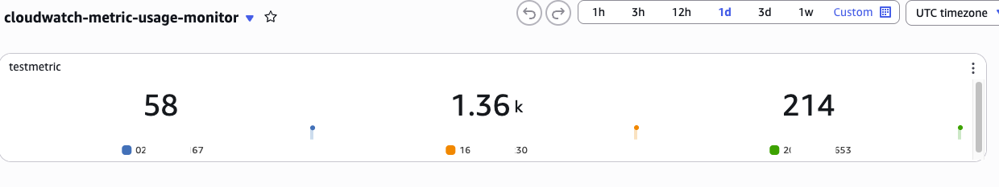

# CloudWatch Metric Usage Lambda

A serverless application that monitors and aggregates CloudWatch metric usage across multiple AWS accounts. This Lambda function executes on a scheduled basis to collect metrics data and publish aggregated usage metrics back to CloudWatch.

## Overview

This project uses AWS Serverless Application Model (SAM) to deploy a Lambda function that:

1. Runs on a scheduled basis (every 5 minutes by default)
2. Lists all CloudWatch metrics across linked accounts
3. Aggregates metric usage data by account
4. Publishes a new CloudWatch metric showing the total metric count for each account

This solution is particularly useful for monitoring organizations with multiple AWS accounts that send metrics to a central monitoring account, helping to track CloudWatch usage and potential costs.

## Sample Dashboard



The solution consists of:

- A Lambda function that executes on a schedule
- IAM permissions to list metrics and publish new metrics
- CloudWatch Events rule for scheduled execution
- A terraform template that can generate a simple monitoring dashboard

## Prerequisites

- [AWS CLI](https://aws.amazon.com/cli/) installed and configured
- [AWS SAM CLI](https://docs.aws.amazon.com/serverless-application-model/latest/developerguide/serverless-sam-cli-install.html) installed
- Python 3.13 or later
- Appropriate AWS permissions to deploy the SAM template

## Project Structure

```
cloudwatch-metric-usage-lambda/
└── sam_helper/
    └── cw-metric-usage-monitor/
        ├── code/
        │   ├── app.py                 # Lambda handler function
        │   ├── cw_metric_helper.py    # CloudWatch API helper class
        │   └── requirements.txt       # Python dependencies
        ├── tests/                     # Unit and integration tests
        ├── template.yaml             # SAM template defining AWS resources
        └── samconfig.toml            # SAM CLI configuration
```

## Installation and Deployment

### Local Development

1. Clone the repository:
   ```
   git clone <repository-url>
   cd cloudwatch-metric-usage-lambda/sam_helper/cw-metric-usage-monitor
   ```

2. Install dependencies:
   ```
   pip install -r code/requirements.txt
   ```

3. Run tests:
   ```
   pytest tests/
   ```

### Deployment

1. Build the SAM application:
   ```
   sam build
   ```

2. Deploy the application:
   ```
   sam deploy --guided
   ```

   Follow the prompts to configure your deployment settings.

3. For subsequent deployments:
   ```
   sam deploy
   ```

## Configuration

The Lambda function can be configured through the following:

- **Schedule**: By default, the function runs every 5 minutes. You can modify this in the `template.yaml` file.
- **Region**: The function is set to monitor metrics in `us-east-1`. You can change this in `app.py`.
- **Namespace and Metric Name**: The aggregated metrics are published to the `testnamespace` namespace with the name `testmetric`. Customize these values in `app.py`.

## How It Works

1. The Lambda function is triggered by a CloudWatch Events rule on a schedule.
2. It uses the CloudWatch API to list all metrics across linked accounts.
3. It aggregates the metrics by account ID and calculates total usage.
4. It publishes a new metric to CloudWatch with the total count for each account.
5. The metrics can be viewed in the CloudWatch console or used for alerting.

## IAM Permissions

The Lambda function requires the following permissions:

- `cloudwatch:ListMetrics`: To retrieve metrics data
- `cloudwatch:PutMetricData`: To publish aggregated metrics

## Monitoring and Troubleshooting

- View the Lambda function logs in CloudWatch Logs
- Monitor the published metrics in CloudWatch Metrics under the `testnamespace` namespace
- Check the Lambda function execution history in the AWS Lambda console


## Contributing

Contributions are welcome! Please read the contributing guidelines before submitting pull requests.


## 📜 License

Distributed under the Apache 2.0 License. See LICENSE for more information.

